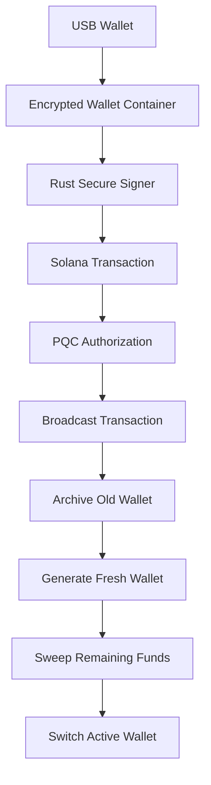

# PQ Wallet

> A rotating USB-based post-quantum Solana cold wallet.

PQ Wallet is a cyberpunk-style terminal cold wallet system built for secure Solana asset management with automatic wallet rotation, encrypted wallet storage, Rust-backed secure signing, and post-quantum cryptographic authorization.

The project combines:

* Solana cold wallet infrastructure
* Automatic wallet rotation
* USB-based wallet isolation
* Rust secure memory signing
* Post-Quantum Cryptography (Dilithium / ML-DSA)
* Live transaction pipeline visualization
* Secure balance sweeping
* In-memory secret wiping
* Cyberpunk terminal UI

---

# Features

## USB Cold Wallet Architecture

Wallets are stored directly on a mounted USB drive.

Each wallet contains:

* Encrypted Solana keypair
* Public key metadata
* PQC identity keys

Wallet data never lives permanently on the host machine.

---

## Automatic Wallet Rotation

After every successful transaction:

1. A brand new Solana wallet is generated
2. Remaining balance is swept automatically
3. Old wallet is archived
4. Active wallet switches instantly

This creates an ephemeral wallet architecture that minimizes long-term key exposure.

---

## Rust Secure Signing

Transactions are signed using a Rust-backed secure signer.

Security features:

* Secure memory isolation
* Automatic memory zeroization
* Reduced Python private key exposure
* Encrypted wallet containers
* Memory cleanup after signing

---

## Post-Quantum Cryptography

PQ Wallet integrates Dilithium / ML-DSA post-quantum signatures.

Each wallet generates:

* Dilithium public key
* Dilithium private key

PQC signatures are used to authorize wallet rotation flows.

This provides a foundation for future post-quantum secure transaction systems.

---

## Live Transaction Pipeline Logging

The TUI displays the entire transaction lifecycle in real time.

Example pipeline:

```text
COLDSTAR TRANSACTION PIPELINE

✓ Blockhash fetched
✓ Transaction built
✓ Wallet decrypted
✓ Transaction signed
✓ Rotation signed
✓ Signature verified
✓ Broadcast success
✓ Wallet archived
✓ Fresh wallet generated
✓ Sweep successful
✓ Active wallet updated
✓ Secure memory cleared
✓ WALLET ROTATION COMPLETE
```

---

# Architecture



---

# Wallet Structure

```text
wallet/
├── keypair.json
├── pubkey.txt
├── dilithium_pub.bin
└── dilithium_sec.bin
```

---

# Security Model

## Encrypted Wallet Storage

Wallets are encrypted before being stored on disk.

## Secure Memory Handling

Sensitive PQC secret keys are wiped from memory after signing.

## USB Isolation

Private wallet material remains isolated on removable storage.

## Wallet Rotation

Every transaction creates a fresh wallet identity.

## PQC Authorization

Wallet rotations require Dilithium signature authorization.

---

# Tech Stack

## Backend

* Python
* Rust
* Solana RPC
* Textual TUI

## Cryptography

* Solana Ed25519
* Dilithium / ML-DSA
* Secure memory zeroization

## Storage

* USB-mounted encrypted wallet containers

---

# Installation

## Clone Repository

```bash
git clone <repo-url>
cd pq-wallet
```

## Install Python Dependencies

```bash
pip install -r local_requirements.txt
```

## Build Rust Signer

```bash
cd secure_signer
cargo build --release
```

---

# Run PQ Wallet

Start the full application:

```bash
python main.py
```

The `main.py` entrypoint initializes the complete PQ Wallet system including:

* USB wallet management
* Rust secure signer
* PQC authorization layer
* Solana network integration
* Live TUI transaction pipeline
* Automatic wallet rotation
* Secure balance sweeping

The TUI wallet interface is launched from the main application flow.

```bash
python tui_wallet.py
```

can still be used independently for direct wallet UI testing and development.

---

# Transaction Flow

1. Load encrypted wallet from USB
2. Fetch latest Solana blockhash
3. Build transaction
4. Securely sign using Rust signer
5. Create PQC rotation authorization
6. Verify Dilithium signature
7. Broadcast transaction
8. Archive old wallet
9. Generate fresh wallet
10. Sweep remaining balance
11. Switch active wallet
12. Clear secure memory

---

# Roadmap

## Completed

* USB wallet system
* Encrypted wallet storage
* Rust secure signer
* Automatic wallet rotation
* Secure balance sweeping
* Live transaction logging
* Dilithium PQC integration
* PQC memory wiping

## Planned

* Hardware enclave support
* Multi-signature PQC authorization
* Air-gapped QR transaction mode
* Cross-chain support
* Offline transaction bundles
* Ledger integration
* Quantum threat monitoring

---

# Disclaimer

PQ Wallet is an experimental security research project.

Do not use with significant real-world funds without extensive auditing and testing.

---

# License

MIT License

---

# Author

Built by Imaad Thouheed.
